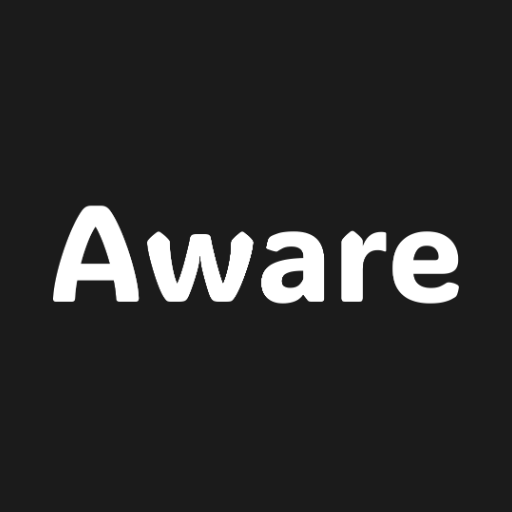
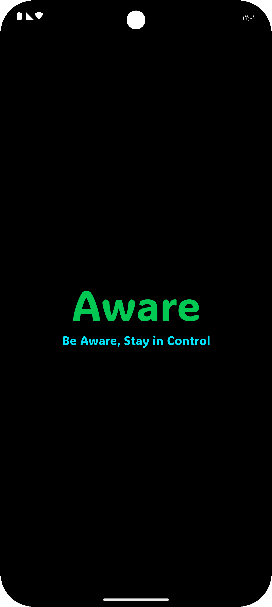
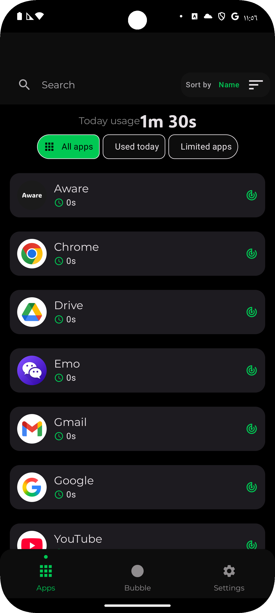
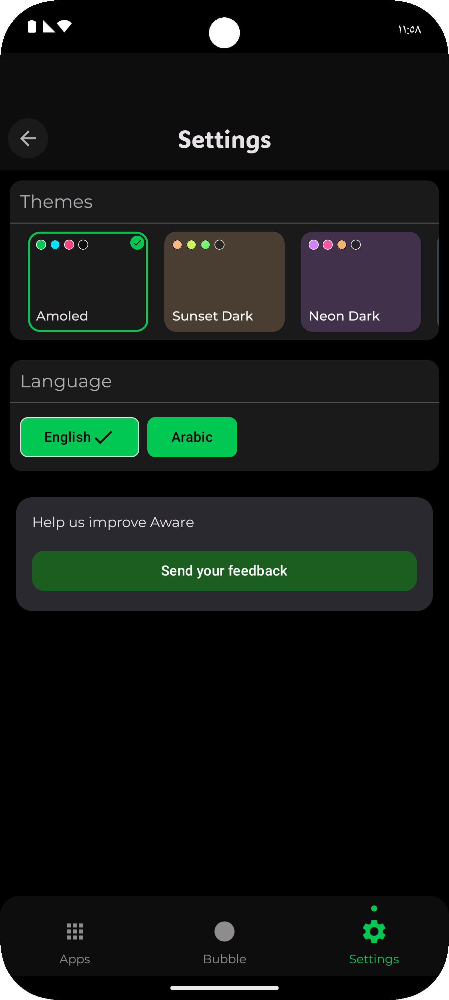
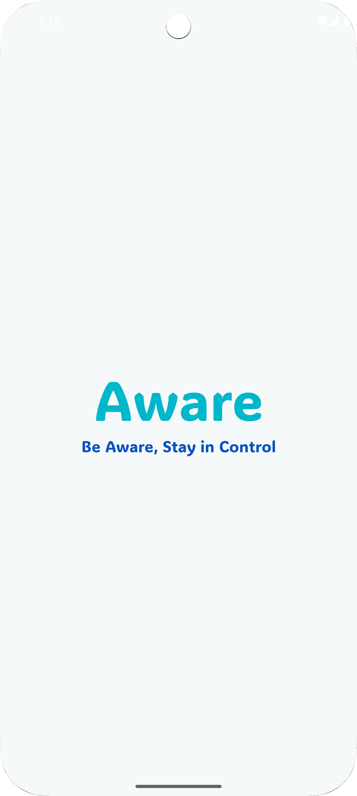
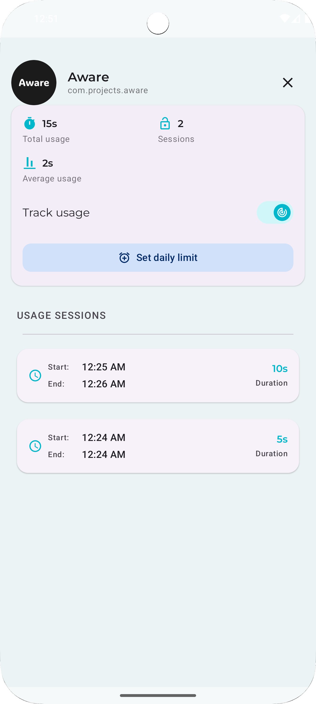

# Aware — Stay aware, be in control

> _Track your time, protect your focus._

  

---

## ✨ Overview

**Aware** is a lightweight, privacy-first screen time tracker that floats a **live counter** over your current app — helping you stay mindful of your usage in real time.

Designed with modern animations, vibrant themes, and deep customization — all with **zero data tracking**.

---

## 🚀 Features at a Glance

| Feature                     | Description                      |
|----------------------------|----------------------------------|
| ⏱️ Live Overlay            | Real-time app usage on screen     |
| 🎨 Vibrant Themes           | 6+ hand-crafted unique themes     |
| 🌐 Multi-language Support   | English & Arabic                  |
| 🧩 Smart Session Tracking   | Clean tracking across all apps    |
| 🔒 100% Offline             | No servers, no tracking           |
| ⚡ Optimized Performance     | Lightweight & battery-friendly    |

---

## 🌈 Personalization

🔹 **Themes**:  
Choose from custom-crafted themes like **Emerald**, **Sunset**, and **Midnight Purple** to match your vibe.

🔸 **Languages**:  
Switch instantly between **English** and **Arabic**, fully localized UI & RTL support.

---

## 🛡 Permissions

> Aware runs **locally** and uses **only what's needed**:

- ✅ `Accessibility Service`: to detect the current foreground app
- ✅ `Overlay Permission`: to show the real-time bubble

📢 _Your data is never uploaded — everything stays on your device._

---

## 📲 Installation & Setup

1. Download from Google Play (available soon)
2. Grant the required **accessibility** & **overlay** permissions
3. if **accessibility** permission was grayed off try unloack `restricted settings` for the app
4. Customize your theme & get aware instantly

---

## 🧭 Why Use Aware?

- No accounts, no ads, no trackers
- Elegant UI with fluid transitions
- Helps reduce screen addiction subtly
- Simple in use
- No battery draining in live usage tracking

---

## 📷 Screenshots

| Splash | Apps list screen | Settings 
|--------------|---------------|----------|
|  |  |  |

| Light theme | App details screen |
|--------------|---------------|
|  |  | 
---

## 🛠 Tech Stack

- **Kotlin + Jetpack Compose**
- **Accessibility API**
- **Material You Theming**
- **MVVM Architecture**

## 🛠️ Tech Stack

  <!-- Core Tech -->
  
  
  
  
  <!-- Development & IDE -->
  
  
  

  <!-- UI/UX & Animation -->
  
  
  <!-- App Features -->
  
  
  
  
  

---

## 📬 Feedback

Found a bug or have a feature idea?  
Send feedback via the app or contact me at:  
📧 **hema.ko.services@gmail.com**
**Or**
You can send me your feedback from **Aware** in `Settings` screen `feedback` section

---
